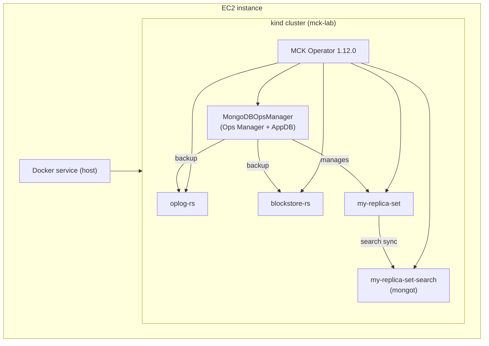

# MCK Lab: Ops Manager + MongoDB + mongot Search + Blockstore Backup on kind (EC2)

A reproducible lab that stands up, on a single EC2 instance:

- A **kind** (Kubernetes-in-Docker) cluster running on the host's Docker service
- The **MongoDB Kubernetes Operator (MCK) 1.12.0**
- A **MongoDBOpsManager** deployment (Ops Manager + Application Database)
- Dedicated **Oplog Store** and **Blockstore** replica sets for Ops Manager backup
- A workload **MongoDB ReplicaSet** with backup enabled (Blockstore snapshots)
- A **MongoDBSearch** resource running **mongot**, authenticated via a `searchCoordinator` user



## Prerequisites

- One EC2 instance, **Amazon Linux 2023 or Ubuntu 22/24.04**, `x86_64`
  - Recommended: `m5.2xlarge` (8 vCPU / 32 GiB) or larger, 100 GiB gp3 root volume.
    Ops Manager + AppDB + 2 backup stores + a replica set + mongot are memory-hungry
    even at `members: 1` (lab-sized). Smaller instances will OOM-kill pods.
  - Security group inbound: 22 (SSH), 8080 (Ops Manager UI, or tunnel it over SSH instead of opening it)
- Outbound internet access (pulls MongoDB Enterprise / Ops Manager / mongot images)
- No pre-existing Docker/K8s tooling required - `00-install-prereqs.sh` installs everything

## You only ever run one command

```bash
git clone <this-repo-url>
cd mck-kind-lab
chmod +x run-all.sh scripts/*.sh

./run-all.sh
```

That's it - you never run any of the `scripts/00`...`09` files yourself.
`run-all.sh` calls every one of them for you, in order, in a single unattended
run. You just watch the terminal.

Total time: roughly 20-40 minutes, dominated by image pulls for Ops Manager,
AppDB, MongoDB Enterprise, and mongot on first run.

## The one point where the terminal will stop and wait for you

Everything is automated except one unavoidable fact: Ops Manager itself has no
headless way to create its very first Organization, Project, and Programmatic
API Key - a human has to click those into existence once, in the Ops Manager
UI, before any project can be automated.

You do not need to remember when to do this or run anything extra for it.
Partway through `./run-all.sh`, the script itself will:

1. Print a boxed banner in your terminal telling you the 6 clicks to make in
   the Ops Manager UI (URL, login, create org, create project, create API key).
2. Stop and wait (`read`) for you to paste back 4 values: Organization ID,
   Project name, Public Key, Private Key.
3. Automatically continue with the remaining steps as soon as you hit Enter.

There is no timeout - it will sit there waiting for as long as you need. If you
walk away, `run-all.sh` will just be paused at that prompt when you come back.

`run-all.sh` also transparently handles one other wrinkle: if this is a brand
new EC2 host and your user was just added to the `docker` group, it re-executes
itself under `sg docker` automatically so you don't have to log out/in.

### Running stage by stage instead

If you want to debug a specific stage, re-run it, or resume after a failure,
the numbered scripts under `scripts/` are still there and can be run
individually in order (`00` through `09`); `run-all.sh` is just a thin wrapper
around them.

## Accessing the Ops Manager UI and logging in

`kind-config.yaml` maps container NodePort `30080` to host port `8080`.

- From the EC2 host itself: `http://localhost:8080`
- From your laptop: `ssh -L 8080:localhost:8080 <user>@<ec2-public-ip>`, then browse
  to `http://localhost:8080` locally.

The login credentials are whatever `03-create-secrets.sh` generated for the
`ops-manager-admin` Secret (it prints them once when first created, but you can
always look them up again):

```bash
kubectl get secret ops-manager-admin -n mongodb -o jsonpath='{.data.Username}' | base64 -d; echo
kubectl get secret ops-manager-admin -n mongodb -o jsonpath='{.data.Password}' | base64 -d; echo
```

This is the same account `05-configure-om-project.sh` already had you log in
with once, mid-run, to create the Organization/Project/API key - so by the
time `run-all.sh` finishes, this login already works. Use it any time
afterwards to get back into the UI.

## Verifying backup is actually working

1. Ops Manager UI -> your Project -> Deployment -> `my-replica-set` -> **Backup** tab.
2. Confirm Oplog Store and Blockstore both show a healthy/green status.
3. Trigger or wait for the first scheduled snapshot; confirm it completes.
4. `kubectl get mdb oplog-rs blockstore-rs -n mongodb` should both show `Running`.

## Verifying Search (mongot)

```bash
kubectl get mdbs -n mongodb
kubectl get pods -n mongodb -l app=my-replica-set-search-search
kubectl exec -it my-replica-set-0 -n mongodb -- mongosh --eval \
  'db.getSiblingDB("test").coll.createSearchIndex({name:"default", definition:{mappings:{dynamic:true}}})'
```

## Scaling this from lab to something closer to production

- Bump `members: 1` to `members: 3` in `manifests/01-ops-manager.yaml`,
  `02-backup-oplog-rs.yaml`, `03-backup-blockstore-rs.yaml`, `04-replica-set.yaml`.
- Move off kind onto a real multi-node cluster (EKS, etc.) with proper storage classes.
- Restrict the API key IP allowlist (lab uses `0.0.0.0/0` - do not do this outside a lab).
- Put TLS in front of Ops Manager and the MongoDB resources (`spec.security.tls`).

## Cleanup

```bash
./scripts/99-cleanup.sh   # prompts for confirmation, deletes the kind cluster
```

This is the one other script you'd run by hand - only when you're done with the lab.

## Repo layout

```
run-all.sh                       single entry point, runs scripts/00-09 in order
kind-config.yaml                 kind cluster definition (NodePort 30080 -> host 8080)
manifests/
  00-namespace.yaml
  01-ops-manager.yaml            MongoDBOpsManager CR
  02-backup-oplog-rs.yaml        Oplog store MongoDB CR
  03-backup-blockstore-rs.yaml   Blockstore MongoDB CR
  04-replica-set.yaml            Workload MongoDB CR (backup enabled)
  05-search-user.yaml            MongoDBUser (searchCoordinator role) for mongot
  06-search.yaml                 MongoDBSearch CR (mongot)
scripts/
  00-install-prereqs.sh
  01-create-cluster.sh
  02-install-crds-operator.sh
  03-create-secrets.sh
  04-deploy-opsmanager.sh
  05-configure-om-project.sh     called automatically by run-all.sh; pauses for UI-created org/project/API key
  06-deploy-backup-stores.sh
  07-deploy-replicaset.sh
  08-deploy-search.sh
  09-validate.sh
  99-cleanup.sh
```

## References

- MCK 1.12.0 release: https://github.com/mongodb/mongodb-kubernetes/releases/tag/1.12.0
- MCK 1.12.0 CRDs: https://raw.githubusercontent.com/mongodb/mongodb-kubernetes/refs/tags/1.12.0/public/crds.yaml

## Other labs

A non-Kubernetes alternative (Ops Manager installed directly on an EC2 host,
no operator, filesystem-store backup) lives in a separate repo:
[native-ops-manager-lab](https://github.com/vijaygh-repo/native-ops-manager-lab).
